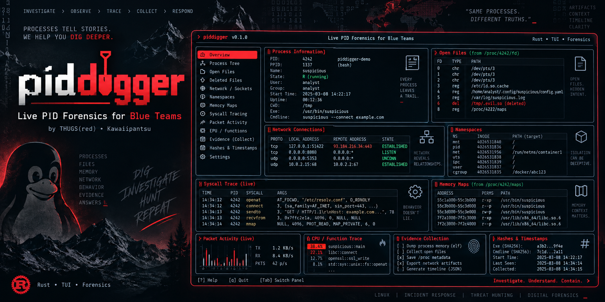
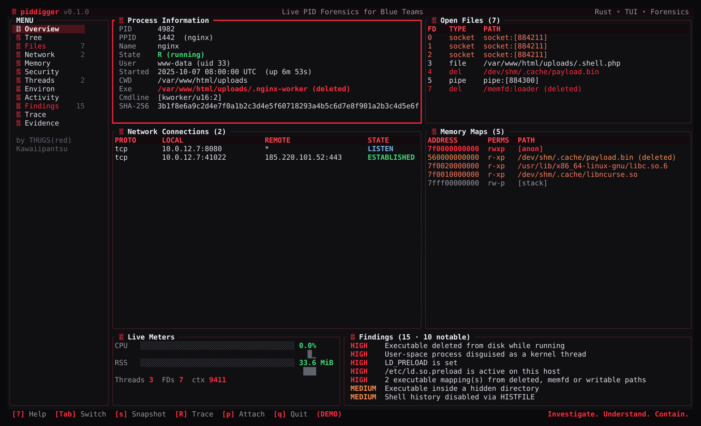

<div align="center">



# piddigger

**Processes tell stories. We help you dig deeper.**

A full-screen Rust investigator for a single running Linux process.<br>
Identity, files, sockets, memory, behaviour and evidence — in one live terminal.


[](https://github.com/kawaiipantsu/piddigger/actions/workflows/build.yml)
[](LICENSE)

[**Download**](https://github.com/kawaiipantsu/piddigger/releases/latest) · [**The views**](#-the-control-room) · [**Install**](#-build--install) · [**Controls**](#-controls) · [**Guide**](docs/GUIDE.md) · [**THUGS(red)**](https://thugs.red)

<samp>by Kawaiipantsu · THUGS(red) · for authorized blue-team work</samp>

</div>

## 🔎 Investigate · Observe · Trace · Collect · Respond

You have a PID and a question: *what is this process actually doing?* `piddigger` attaches to a running process on the local host and lays out everything `/proc` knows about it — then lets you trace its behaviour and preserve the evidence, without changing the target.

**Collection is read-only by default.** piddigger never writes to, signals or stops the target to build its views. Tracing and memory dumps are separate, opt-in actions that each state their impact before you run them.

| | What you get |
| :-- | :-- |
| 🧬 **Who it is** | PID/PPID, full ancestry and children, UID/GID transitions, start time, cmdline vs. `comm`, executable path, size, owner, timestamps and **SHA-256** — even when the binary was deleted or runs from a memfd. |
| 📂 **What it holds** | Every open descriptor with type and flags, **deleted-but-open** files, memfds, pipes and anon inodes — recoverable into the case with one key. |
| 🌐 **Where it talks** | TCP/UDP/raw/unix/**packet**/netlink sockets resolved from the process's own descriptors, with live state and queue depth. |
| 🧠 **What's in memory** | Full map table with RWX, deleted-file-backed and memfd regions flagged; RSS/PSS/anon/file/swap summary and live history. |
| 🛡️ **What it can do** | Effective/permitted/bounding **capabilities**, seccomp mode, no_new_privs, LSM label, tracer, namespaces and cgroup. |
| 🧵 **How it runs** | Per-thread state, CPU, scheduler and wait channel; the full environment with injection-relevant variables highlighted. |
| ⚠️ **What stands out** | A triage engine that flags fileless execution, masquerading, reverse shells, LD_PRELOAD injection, RWX memory, sniffers and anti-forensics — each a **lead, with evidence and a next step**. |
| ⏱️ **What just changed** | A live activity timeline that diffs each refresh: new sockets, descriptors, threads, children and executable mappings. |
| 📦 **Proof you can keep** | A write-once evidence case: raw `/proc` copies, the executable, recovered files and trace output, all **SHA-256 hashed** with an append-only chain-of-custody log. |

## 🖥️ The control room

A left menu switches between twelve views; the Overview is a live dashboard. Themed with the THUGS(red) palette, ANSI/CP box borders and a block design, with Nerd Font icons and an ASCII fallback.



*Actual terminal capture (`--demo`, thugsred theme). More: [Findings](assets/screenshots/findings.svg) · [Trace menu](assets/screenshots/trace.svg).*

```text
> piddigger v0.1.0              Live PID Forensics for Blue Teams              Rust • TUI • Forensics
╭ MENU ────────────────╮┏ Process Information ━━━━━━━━━━━━━━━━━━━━━━┓╭ Open Files (7) ─────────────────────╮
│  Overview            │┃ PID      4982                            ┃│ FD  TYPE   PATH                     │
│  Tree                │┃ Name     nginx                           ┃│ 4   del    /dev/shm/.cache/payload  │
│  Files          7    │┃ State    R (running)                     ┃│ 7   del    /memfd:loader (deleted)  │
│  Network        2    │┃ Exe      …/.nginx-worker (deleted)       ┃╰─────────────────────────────────────╯
│  Findings       15   │┃ SHA-256  3b1f8e6a9c2d…                    ┃╭ Memory Maps (5) ────────────────────╮
│  …                   │┗━━━━━━━━━━━━━━━━━━━━━━━━━━━━━━━━━━━━━━━━━━━┛│ 7f00…  rwxp  [anon]            ⚠ RWX │
╰──────────────────────╯                                            ╰─────────────────────────────────────╯
 [?] Help  [Tab] Switch  [s] Snapshot  [R] Trace  [p] Attach  [q] Quit        Investigate. Understand. Contain.
```

| View | Focus |
| :-- | :-- |
| **Overview** | Dashboard: identity, open files, connections, memory maps, live meters and top findings |
| **Tree** | Full ancestry up to PID 1 and the process's children |
| **Files** | Every descriptor; deleted/memfd highlighted; `Enter` recovers the selected one |
| **Network** | All socket families held by the process, with raw/packet sockets flagged |
| **Memory** | RSS/PSS summary and the complete map table with RWX and deleted-backed regions marked |
| **Security** | UID/GID, capabilities, seccomp, no_new_privs, LSM label, namespaces and cgroup |
| **Threads** | Per-thread state, CPU, scheduler and wait channel |
| **Environ** | The process environment, injection-relevant variables highlighted (`n` hides values) |
| **Activity** | Live timeline of descriptors, sockets, threads, children and exec mappings appearing/vanishing |
| **Findings** | Triage leads with the evidence that triggered them and a suggested next step |
| **Trace** | Live strace/ltrace/perf/bpftrace/tcpdump/gdb output, streamed and hashed into the case |
| **Evidence** | Hashes, timestamps, case status and the chain-of-custody log |

## 📦 Build & install

Download the `.deb` for your architecture from [Releases](https://github.com/kawaiipantsu/piddigger/releases/latest):

```sh
sudo apt install ./piddigger_0.1.0_amd64.deb
sudo piddigger          # root (or CAP_SYS_PTRACE) gives complete visibility
```

Build from source with Rust 1.94+, make, binutils and dpkg-deb:

```sh
git clone https://github.com/kawaiipantsu/piddigger.git
cd piddigger
make build
make test check
make deb
sudo dpkg -i dist/piddigger_0.1.0_amd64.deb
```

The trace features use standard tools when present: `strace`, `ltrace`, `linux-perf`, `bpftrace`, `tcpdump`, `gdb`. They are **Recommends/Suggests**, not hard dependencies — piddigger tells you what to `apt install` when you pick a capture that needs one.

## 🚀 Usage

```sh
piddigger 4982                 # investigate PID 4982
piddigger                      # open the process picker and choose
piddigger --demo               # explore a synthetic suspicious process, no root needed
piddigger 4982 --report        # print a plain-text triage report and exit
piddigger 4982 --json          # print one machine-readable snapshot and exit
piddigger 4982 --theme daylight --no-icons --ascii
```

`--report` and `--json` are non-interactive and scriptable — useful from an IR playbook or over SSH without a full terminal.

## 🎛️ Controls

| Key | Action |
| :-- | :-- |
| `Tab` / `←` `→`, `1`–`9` `0` `r` `c` | Switch view |
| `↑` `↓` `j` `k`, `PgUp` `PgDn` | Scroll |
| `p` | Process picker — attach to another PID |
| `Space` | Pause / resume live refresh |
| `+` / `-` | Faster / slower refresh (250 ms – 10 s) · `g` refresh now |
| `R` | Trace menu (strace, ltrace, perf, bpftrace, tcpdump, gdb, gcore) · `x` stop |
| `s` | Snapshot `/proc` + executable + deleted files into the case |
| `Enter` | On **Files**: recover the selected deleted-but-open file |
| `v` | Verify every artifact's SHA-256 against the manifest |
| `t` / `T` | Cycle theme / theme picker · `n` show-hide env values |
| `?` / `F1` | Help · `q` / `Esc` quit |

**Themes:** `thugsred` (default) · `midnight` · `carbon` · `dracula` (dark) · `twilight` (semi-light) · `daylight` (light). Use a true-color terminal with a Nerd Font for icons; `--no-icons`/`--ascii` fall back cleanly. **160×48 looks great**; the minimum is 80×20.

## 🧷 Evidence & chain of custody

Press `s` and piddigger opens a case folder and preserves a complete snapshot, most-volatile first:

```text
piddigger-case-<host>-<pid>-<UTC>/
  case.json          tool version + SHA-256, collector identity, target, host
  custody.log        append-only, timestamped: OPEN / COLLECT / SNAPSHOT / VERIFY / CLOSE
  SHA256SUMS         manifest of every artifact (sha256sum -c compatible)
  snap-001-<UTC>/    raw /proc copies, report.json, findings, activity, exe/, recovered/
  trace/             strace / perf / bpftrace / tcpdump / gdb output
```

Artifacts are written **once** and sealed read-only (mode 0400). The executable is copied through `/proc/<pid>/exe`, so a **deleted or memfd binary is still recovered**. Deleted-but-open files are pulled back through their descriptors. Everything is SHA-256 hashed as it lands, and `v` re-verifies the whole case:

```sh
cd piddigger-case-web-prod-07-4982-20261006T121314Z
sha256sum -c SHA256SUMS
```

## 🔬 What the capture profiles mean

Each profile states its **impact** so you decide before touching a live system:

| Impact | Meaning | Profiles |
| :-- | :-- | :-- |
| `observe` | Kernel-side; the target is not stopped | perf, bpftrace (syscalls/files/exec), tcpdump |
| `ptrace` | Attaches with ptrace; slows the target and is visible via `TracerPid` | strace (all/file/net/process/summary), ltrace |
| `pause` | Briefly stops every thread while it runs | gdb backtraces, gcore memory image |

tcpdump is auto-filtered to the ports the target currently uses; perf and gcore keep their `perf.data` / core file in the case. piddigger warns when kernel `yama/ptrace_scope` will block an attach for non-root.

## ⚖️ Scope & limitations

- **Authorized use only.** piddigger is a defensive DFIR tool for systems you are responsible for.
- Collection is read-only; **tracing and dumps are opt-in** and labelled by impact.
- **Findings are leads, not verdicts** — JIT runtimes legitimately use RWX memory, services keep rotated logs deleted-but-open, and containers legitimately use private namespaces. piddigger gives you the evidence to decide.
- Without root or `CAP_SYS_PTRACE` some `/proc` entries are unreadable; piddigger says so rather than inventing data.
- A process can exit mid-investigation; piddigger keeps the last snapshot and marks it exited.

## 🖤 Community & attribution

Made by **Kawaiipantsu** for the **[THUGS(red)](https://thugs.red)** security community — red team, threat hunting and research.

Built with [Rust](https://www.rust-lang.org/), [Ratatui](https://ratatui.rs/) and [Crossterm](https://github.com/crossterm-rs/crossterm). `/proc` semantics follow [proc(5)](https://man7.org/linux/man-pages/man5/proc.5.html).

[MIT licensed](LICENSE). Use synthetic examples in reports; never publish real target data, captured secrets or host details.

---

<div align="center">

**THUGS(red)** · [thugs.red](https://thugs.red) · <samp>Linux · Incident Response · Threat Hunting · Digital Forensics</samp>

<sub>Same processes. Different truths.</sub>

</div>
